# H O R Q U V A ®
## Internship Tasks — Week II: Enterprise Ontology Platform
**Status:** Constitutional Platform Architecture  
**Classification:** Internal Engineering Constitution  
**Submitted By:** Muhammad Hamza  
**Version:** 1.0  
**Confidential & Proprietary** — © Horquva Technologies. All Rights Reserved.  

---

# Constitutional Organizational Primitives

## Enterprise Architecture
EA is a conceptual framework that describes how the business is constructed. It identifies the primary components and shows the relationship between them so that we get exactly what we need to understand so that the business we build delivers the value it is supposed to do.

The main focus of EA is to simplify complexity and understand how business and technology work together.

## Horquva's Synthetic Enterprise Architecture
Arcturus introduces **Synthetic Enterprise Engineering**, which simulates infrastructure by replicating the structure, behavior, workflows, constraints, and decision patterns of an actual enterprise while it remains synthetic and risk-free.

This allows the Organizational Brain (OBA) to:
* Experiment
* Validate
* Predict Organizational Behaviors

This simulates the complete organization as a living system. It is organized into 9 layers that are interconnected to each other:
1. Synthetic Enterprise Layer
2. Organizational Digital Twin Layer
3. Synthetic Workforce Layer
4. Workflow Simulation Layer
5. Agent-Based Simulation Layer
6. Scenario Generation Layer
7. Simulation Execution Engine
8. Validation and Evaluation Layer
9. Confidence and Evidence Layer

---

## Primary Constitutional Entities

### Organization
Highest level entity representing the company as a unified structure.

* **Purpose and Responsibility:** Serves as the ultimate container for all the other entities, assets, and operations.
* **Connects to:** Belongs to no entity; contains Divisions.
* **Rules:** Must be one.
* **Who else needs it:** Synthetic Enterprise Layer, Organizational Digital Twin Layer, Synthetic Workforce Layer, Scenario Generation Layer.

| Field | Type | Needed | Notes |
| :--- | :--- | :--- | :--- |
| `org_id` | integer | yes | unique_id |
| `org_name` | string | yes | e.g., "Horquva" |
| `address` | string | maybe | location of the organization |
| `leader` | string | no | the head of the whole org |

### Division
An operational segment within an organization.

* **Purpose and Responsibility:** Manages a specific part of the business area, ensuring its units align with the organization's macro-level objectives.
* **Connects to:** Belongs to Organization; contains Departments.
* **Rules:** Must not be independent; needs to belong to one Organization.
* **Who else needs it:** Scenario Generation Layer, Validation and Evaluation Layer.

| Field | Type | Needed | Notes |
| :--- | :--- | :--- | :--- |
| `div_id` | integer | yes | unique_id |
| `div_name` | string | yes | e.g., "Simulation Division" |
| `org_id` | integer | yes | which org it falls under |

### Department
A specialized functional unit operating within a division.

* **Purpose and Responsibility:** Executes specific operational functions and delivers outcomes that are in line with the Division's directives.
* **Connects to:** Belongs to Division; contains Team.
* **Rules:** Workflows must be provided according to the Department's expertise.
* **Who else needs it:** Workflow Simulation Layer, Synthetic Enterprise Layer.

| Field | Type | Needed | Notes |
| :--- | :--- | :--- | :--- |
| `dept_id` | integer | yes | unique_id |
| `div_id` | integer | yes | which div it falls under |
| `dept_name` | string | no | e.g., "HR" |
| `cost` | float | no | total resources used |

### Team
Group of people organized within a department having similar tasks and functions.

* **Purpose and Responsibility:** Collaborating daily to perform specific tasks and deliver projects.
* **Connects to:** Belongs to Department; contains Employee; has Capability and Process.
* **Rules:** Employees within the same team share immediate knowledge and context.
* **Who else needs it:** Agent-Based Simulation Layer.

| Field | Type | Needed | Notes |
| :--- | :--- | :--- | :--- |
| `team_id` | integer | yes | unique_id |
| `dept_id` | integer | yes | which dept it falls under |
| `total_employees` | integer | yes | max employees |

### Employee
An individual contributor.

* **Purpose and Responsibility:** Applying their skills and expertise to execute tasks, objectives, and fulfill the required role given to them.
* **Connects to:** Belongs to Team; assigned to Role; executes Workflow and Decisions.
* **Rules:** To execute a workflow, at least one role needs to be assigned to the employee.
* **Who else needs it:** Synthetic Workforce Layer, Agent-Based Simulation Layer, Confidence and Evidence Layer.

| Field | Type | Needed | Notes |
| :--- | :--- | :--- | :--- |
| `employee_id` | integer | yes | unique_id |
| `name` | string | no | e.g., "Ali" |
| `role_id` | integer | yes | what the employee has to do |
| `status` | string | yes | active, inactive, overload |

### Role
Blueprint of responsibilities, permissions, and expectations.

* **Purpose and Responsibility:** Defines what an employee is supposed to achieve, dictates their system access, and establishes accountability.
* **Connects to:** Assigned to Employee; enables Capability; governed by Policy.
* **Rules:** A role must grant access to one capability for the employee to interact with the simulation. An Employee executes a workflow only because they currently occupy the authorized Role within that Team/Department.
* **Who else needs it:** Synthetic Workforce Layer, Workflow Simulation Layer, Agent-Based Simulation Layer.

| Field | Type | Needed | Notes |
| :--- | :--- | :--- | :--- |
| `role_id` | integer | yes | unique_id |
| `role_title` | string | yes | e.g., "Enterprise Engineer" |
| `access_level` | integer | yes | authorization level granted |

### Policy
Documented set of rules, principles, and guidelines.

* **Purpose and Responsibility:** Enforces security standards which mitigate the organization's risks.
* **Connects to:** Governs Role, Process, and Decision; mitigates Risk.
* **Rules:** Policies must be evaluated as boolean logic (`pass`/`fail`) by the simulation engine during workflow execution.
* **Who else needs it:** Simulation Execution Engine, Validation and Evaluation Layer.

| Field | Type | Needed | Notes |
| :--- | :--- | :--- | :--- |
| `policy_id` | integer | yes | unique_id |
| `logic` | string | yes | the rule that needs to be checked |
| `severity_level` | string | yes | low, medium, critical |

### Capability
A strategic combination of people, processes, and technology.

* **Purpose and Responsibility:** Enables the organization to perform core business functions.
* **Connects to:** Owned by Department; executes Process; needs Asset, Resources.
* **Rules:** If a Department loses the required Resources or Employees for a Capability during a simulation, that Capability's readiness state must drop to zero.
* **Who else needs it:** Scenario Generation Layer, Synthetic Enterprise Layer.

| Field | Type | Needed | Notes |
| :--- | :--- | :--- | :--- |
| `cap_id` | integer | yes | unique_id |
| `dept_id` | integer | yes | which dept it falls under |
| `readiness_score` | float | yes | metric of when it can be executed |

### Process
Structured, repeated sequence of activities.

* **Purpose and Responsibility:** Transforms inputs into valuable outputs consistently, which ensures that complex operations scale efficiently.
* **Connects to:** Enabled by Capability; parent of Workflow; uses Resources.
* **Rules:** A process cannot execute directly; it must spawn a specific Workflow instance to actually route tasks to agents.
* **Who else needs it:** Simulation Execution Engine, Validation and Evaluation Layer.

| Field | Type | Needed | Notes |
| :--- | :--- | :--- | :--- |
| `process_id` | integer | yes | unique_id |
| `cap_id` | integer | yes | which capability it falls under |
| `duration` | float | yes | minimum time it should take |

### Workflow
Tactical step-by-step routing of tasks within a process.

* **Purpose and Responsibility:** Automates or guides the daily execution of work, which ensures that tasks are routed to the right role.
* **Connects to:** Instance of Process; assigned to Role, Employee; triggered by Event.
* **Rules:** Workflows must pause or fail if the Employee is unavailable or if a Policy blocks the transition.
* **Who else needs it:** Workflow Simulation Layer, Synthetic Workforce Layer.

| Field | Type | Needed | Notes |
| :--- | :--- | :--- | :--- |
| `workflow_id` | integer | yes | unique_id |
| `process_id` | integer | yes | which process it uses |
| `state` | string | yes | completed, pending, blocked |

### Event
An important occurrence within a business environment.

* **Purpose and Responsibility:** Initiates workflows, alerts systems to operational decisions, or signals that a process must begin or end.
* **Connects to:** Triggers Workflow, Decision; may generate Risk.
* **Rules:** Events must carry a timestamp and a specific payload of data so simulated agents know exactly what they are reacting to.
* **Who else needs it:** Scenario Generation Layer, Agent-Based Simulation Layer.

| Field | Type | Needed | Notes |
| :--- | :--- | :--- | :--- |
| `event_id` | integer | yes | unique_id |
| `type` | string | yes | system_alert, minor_update |
| `timestamp` | integer | yes | exact Unix timestamp when the event occurred |

### Goal
A specific objective within a defined time.

* **Purpose and Responsibility:** Provides a clear target for organizational efforts and acts as a metric for success.
* **Connects to:** Evaluates Capability, Process; assigned to Organization, Division.
* **Rules:** Must be mathematically measurable so the engine can evaluate success or failure.
* **Who else needs it:** Validation and Evaluation Layer, Confidence and Evidence Layer.

| Field | Type | Needed | Notes |
| :--- | :--- | :--- | :--- |
| `goal_id` | integer | yes | unique_id |
| `target_metric` | float | yes | value of success |
| `time_horizon` | string | yes | ISO-8601 target timestamp to meet |

### Decision
Formal choice or commitment to a specific action.

* **Purpose and Responsibility:** Resolves uncertainty, authorizes resource allocation, and starts workflows.
* **Connects to:** Triggered by Event, Workflow; requires Knowledge, Policy; triggers Event, Workflow.
* **Rules:** Every decision made by a synthetic agent must log the context and constraints that led to that specific branch being taken.
* **Who else needs it:** Agent-Based Simulation Layer, Validation and Evaluation Layer.

| Field | Type | Needed | Notes |
| :--- | :--- | :--- | :--- |
| `decision_id` | integer | yes | unique_id |
| `emp_id` | integer | yes | employee that made the decision |
| `chosen_branch` | string | yes | the specific path taken |

### Knowledge
Documented expertise and data insights.

* **Purpose and Responsibility:** Informs strategic decision-making, accelerates onboarding, and preserves organizational memory.
* **Connects to:** Informs Decision, Workflow; owned by Employee, Team, Organization.
* **Rules:** Knowledge access must strictly adhere to the agent's Role and Policy constraints; agents cannot use data in the simulation that they wouldn't have access to.
* **Who else needs it:** Synthetic Workforce Layer, Agent-Based Simulation Layer.

| Field | Type | Needed | Notes |
| :--- | :--- | :--- | :--- |
| `knowledge_id` | integer | yes | unique_id |
| `domain_tag` | string | yes | categorizes knowledge |
| `access_level` | integer | yes | minimum authorization level required |

### Risk
An event or condition that could impact operations negatively.

* **Purpose and Responsibility:** Acts as an entity so that it can be defined and mitigated to protect an organization's assets, goals, and operational stability.
* **Connects to:** Mitigated by Policy, Decision; threatens Capability, Assets, Goals.
* **Rules:** Must include a probability distribution so the simulation execution engine can dynamically roll against it to trigger unexpected failures.
* **Who else needs it:** Scenario Generation Layer, Validation and Evaluation Layer.

| Field | Type | Needed | Notes |
| :--- | :--- | :--- | :--- |
| `risk_id` | integer | yes | unique_id |
| `probability_score` | float | yes | likelihood of occurrence |
| `impact_severity` | string | yes | low, medium, high |

### Asset
Items of value.

* **Purpose and Responsibility:** Deployed within an operation to generate value and support workflows.
* **Connects to:** Owned by Organization, Division, Department; used by Workflow, Capability; threatened by Risk, Event.
* **Rules:** Assets must have a defined operational state; if an asset is taken offline by an injected simulation event, any dependent active workflows must automatically pause or fail.
* **Who else needs it:** Organizational Digital Twin Layer, Scenario Generation Layer.

| Field | Type | Needed | Notes |
| :--- | :--- | :--- | :--- |
| `asset_id` | integer | yes | unique_id |
| `asset_type` | string | yes | e.g., "Physical Infrastructure" |
| `operational_state` | string | yes | active, degraded, offline |

### Resource
A finite input required to complete work.

* **Purpose and Responsibility:** Fuels processes and projects.
* **Connects to:** Consumed by Workflow, Process; allocated via Decision.
* **Rules:** Workflows must calculate resource burn rates; if the available resource pool drops to zero, the execution engine must halt dependent tasks.
* **Who else needs it:** Workflow Simulation Layer, Validation and Evaluation Layer.

| Field | Type | Needed | Notes |
| :--- | :--- | :--- | :--- |
| `resource_id` | integer | yes | unique_id |
| `quantity_available` | float | yes | amount left in real time |
| `depletion_rate` | float | yes | speed at which it is consumed |

### Relationships
Connections between two entities.

* **Purpose and Responsibility:** Maps dependencies and defines the complex web of interactions that make the organizational architecture work.
* **Connects to:** Any entity with another.
* **Rules:** Must strictly define directionality (e.g., Parent-to-Child, Peer-to-Peer) and must not create infinite operational loops that could trap the simulation engine.
* **Who else needs it:** Synthetic Enterprise Layer, Simulation Execution Engine.

---

# Organizational Relationships and Domain Model

## Reporting Structures
* **What it maps:** Defines the chain of command and escalation paths within the synthetic enterprise. It connects Employees to Roles and establishes a hierarchical link between different Roles.
* **Why we need it in simulation:** When an autonomous agent encounters a blocked Workflow or a Risk event triggers, the Simulation Execution Engine uses this reporting structure to escalate the Decision up the chain of command to the correct managerial agent.
* **Rules & Constraints:** An Employee can hold multiple Roles, but a specific Role can only report to one parent Role to prevent infinite escalation loops.

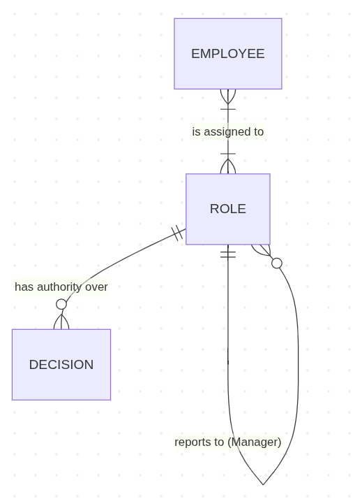

---

## Department Ownership
* **What it maps:** Defines the structural hierarchy of business units, linking Organizations to Divisions, and Divisions to Departments. It also maps which Department owns specific Capabilities and Assets.
* **Why we need it in simulation:** If the Scenario Generation Layer injects a macroeconomic shock (like a 20% budget cut to a Division), the execution engine traces this ownership graph downward to degrade the Capabilities of the specific Departments owned by that division.
* **Rules & Constraints:**
  * A Department must be owned by exactly one Division.
  * A Capability cannot exist without an owning Department.

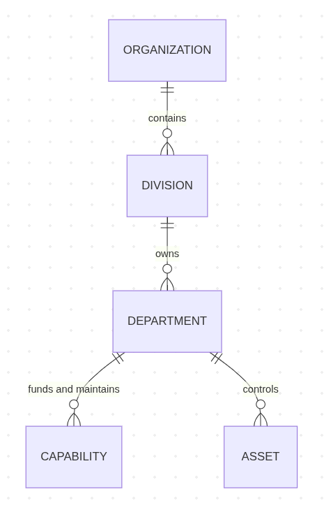

---

## Team Membership
* **What it maps:** Defines the collaborative clusters within a Department, linking Employees (Agents) to specific Teams.
* **Why we need it in simulation:** This defines the micro-environment for the Agent-Based Simulation Layer. During a scenario, the engine assumes that agents within the same Team share immediate knowledge context, communication nodes, and workflow backlogs.
* **Rules & Constraints:**
  * An employee must be assigned to at least one Team to actively participate in simulated workflows.
  * A team cannot exceed its max number of employees.

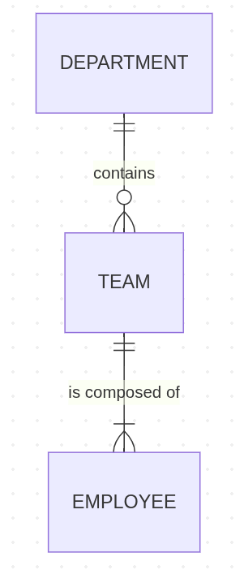

---

## Capability Ownership
* **What it maps:** Defines which Department has authority and budget over specific business functions (Capabilities).
* **Why we need it in simulation:** If a simulation scenario injects an event like a resource constraint to a Department, the execution engine needs to trace this graph to know exactly which Capabilities lose readiness and which Processes will subsequently fail.
* **Rules & Constraints:**
  * A Capability must be owned by exactly one Department; it cannot be orphaned.
  * A Capability must execute at least one process to provide simulated value.

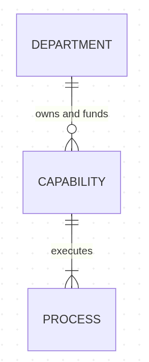

---

## Policy Governance
* **What it maps:** Connects constitutional Policies to the Roles, Processes, Decisions, and Risks they regulate and restrict.
* **Why we need it in simulation:** Before the Simulation Execution Engine allows an agent to make a Decision or advance a Process, it evaluates this relationship graph. If a connected Policy evaluates to `"fail"`, the execution engine blocks the action to ensure the synthetic enterprise behaves realistically.
* **Rules & Constraints:** A Policy must govern at least one operational or human entity; otherwise, it will act as dead logic in a simulation.

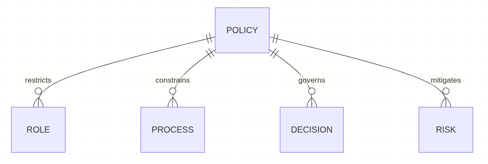

---

## Knowledge Relationships
* **What it maps:** Defines how information and expertise flow through the synthetic enterprise, connecting Knowledge objects to Employees, Teams, Decisions, and Workflows.
* **Why we need it in simulation:** In the digital twin, Knowledge acts as the structured memory accessible to synthetic agents. The Agent-Based Simulation Layer queries these connections to determine if an agent actually possesses the necessary expertise to make a correct Decision or successfully execute an assigned Workflow.
* **Rules & Constraints:**
  * Knowledge access must strictly adhere to the permissions defined by an Employee's Role.
  * A complex Decision branch within a simulation often requires a specific Knowledge object as a mandatory input.

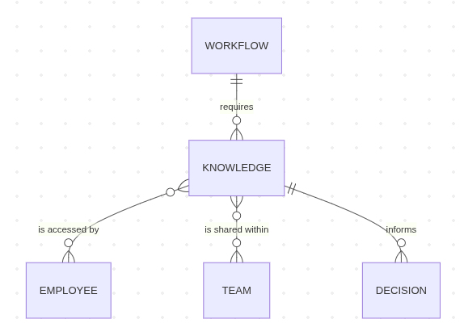

---

## Workflow Participation
* **What it maps:** Defines how human and operational entities interact during task execution by connecting Employees and Roles to active Workflows, as well as mapping the Events that trigger them.
* **Why we need it in simulation:** The Workflow Simulation Layer uses these edges as its primary routing logic. When an Event spawns a new Workflow, the execution engine checks this graph to route the subsequent tasks only to Employees who hold the appropriate Role to participate.
* **Rules & Constraints:**
  * An Employee can only participate in a workflow if their assigned Role explicitly authorizes it.
  * A Workflow cannot progress if there is no Employee linked to it.

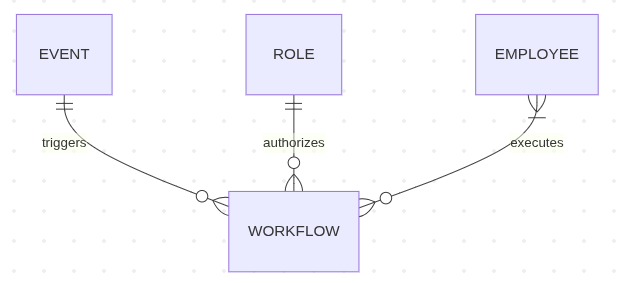

---

## Asset Ownership
* **What it maps:** Connects physical or digital Assets to the specific organizational units (like a Department) that own and maintain them, and maps the Capabilities that depend on them.
* **Why we need it in simulation:** If the Scenario Generation Layer injects a disruption—such as a server outage or a supply chain failure—the simulation execution engine traverses this graph. By knowing which Asset is compromised, the engine can accurately degrade the connected Capabilities and stall dependent workflows.
* **Rules & Constraints:**
  * An asset must be strictly owned by an organizational unit.
  * If an asset changes its state to `"Offline"`, any Capability utilizing it must recalculate its readiness score.

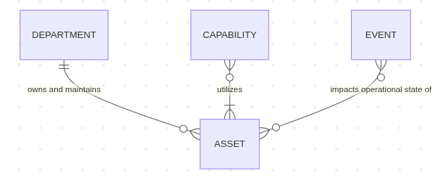

---

## Decision Authority
* **What it maps:** Connects Roles and Employees to specific Decisions, and links those Decisions to the Resources they allocate or the Workflows they trigger.
* **Why we need it in simulation:** In the Agent-Based Simulation Layer, synthetic agents must evaluate their authorization boundaries before committing to an action. The execution engine relies on this graph to verify if an agent has the authority to make a specific choice autonomously, or if the logic requires them to escalate the decision up the reporting structure.
* **Rules & Constraints:**
  * A Decision can only be executed by an Employee currently holding a Role with the required authorization level.
  * Every simulated Decision branch must log the employee who executed it for validation auditing.

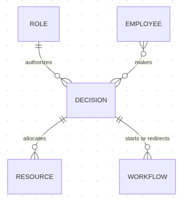

---

## Organizational Dependencies
* **What it maps:** Maps the macro-level operational reliance across the enterprise, connecting Departments to other Departments, and mapping how Capabilities rely on each other to function.
* **Why we need it in simulation:** This is the most critical graph for simulating cascading organizational failures. If the Scenario Generation Layer degrades a Capability in one department, the Simulation Execution Engine traverses this dependency graph to mathematically calculate which downstream Capabilities in other departments will be starved of inputs and forced to halt.
* **Rules & Constraints:**
  * Dependencies must be strictly directed (e.g., `"Capability A requires Capability B"`).
  * The relationship graph cannot contain infinite dependency loops as it would cause the simulation engine to freeze (e.g., `"A depends on B, B depends on C, C depends on A"`).

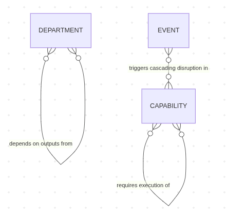

---

# Capability and Governance Ontology

### Business Capability
A specific ability or capacity that the organization possesses to achieve a specific purpose or outcome.
* **Purpose:** Acts as a functional module that the Simulation Execution Engine can toggle on, degrade, or turn off based on available resources and synthetic events.

| Field | Type | Note |
| :--- | :--- | :--- |
| `capability_id` | integer | unique_id |
| `capability_name` | string | e.g., "Synthetic Payroll Execution" |
| `status` | string | active, inactive, degrading |

### Organizational Functions
A logical grouping of related business capabilities, people, and processes that execute a specific part of the enterprise's mission.
* **Purpose:** Provides the structural boundary for the Synthetic Enterprise Layer, allowing the engine to isolate workflows during a scenario run.

| Field | Type | Note |
| :--- | :--- | :--- |
| `function_id` | integer | unique_id |
| `function_type` | string | core, support, strategic |

### Governance Model
The framework of rules, practices, and processes by which organizational entities are directed and controlled.
* **Purpose:** Acts as the master rule engine for the digital twin. It dictates which Policies are active during a specific simulation scenario, shaping how synthetic agents evaluate decisions.

| Field | Type | Note |
| :--- | :--- | :--- |
| `gov_model_id` | integer | unique_id |
| `framework_type` | string | e.g., "Agile" |

### Policies
A high-level, documented set of constitutional principles, directives, or operating boundaries established by a Governance Model.
* **Purpose:** Acts as the master logic filter that governs agent choices, operational workflows, and risk mitigation strategies. While a Governance Model establishes the framework, a Policy defines the specific behavioral rules that prevent the synthetic enterprise from entering invalid or unauthorized states.

| Field | Type | Note |
| :--- | :--- | :--- |
| `policy_id` | integer | unique_id |
| `gov_model_id` | integer | which governance model it falls under |
| `scope_domain` | string | e.g., "HR", "Security" |
| `enforcement_type` | string | "log_only", "strict_blocking" |

### Compliance Rules
Specific, enforceable operational constraints derived from a broader Policy.
* **Purpose:** Translates business rules into computable boolean logic (`pass`/`fail`). If an agent or workflow attempts an action that violates this rule, the Simulation Execution Engine blocks it.

| Field | Type | Note |
| :--- | :--- | :--- |
| `rule_id` | integer | unique_id |
| `eval_logic` | string | executable code |
| `penalty_score` | float | penalty score if breached |

### Objectives
Defined target state or strategic aim that an organizational function is programmed to achieve during a simulation run.
* **Purpose:** Acts as the absolute success criteria for a scenario experiment. The Validation and Evaluation Layer uses Objectives to mathematically determine if the synthetic enterprise successfully adapted to an injected disruption or if it failed.

| Field | Type | Note |
| :--- | :--- | :--- |
| `obj_id` | integer | unique_id |
| `target_state` | string | simulation state required for success |
| `time_horizon` | string | ISO-8601 target timestamp to achieve |

### KPIs (Key Performance Indicators)
Critical, high-level quantifiable measures used to evaluate the overarching success or health of an Objective within the synthetic enterprise.
* **Purpose:** Provides the macro-level health score for a Capability or Department. The execution engine tracks KPIs over time to model how organizational performance degrades when resources are constrained or risks are triggered.

| Field | Type | Note |
| :--- | :--- | :--- |
| `kpi_id` | integer | unique_id |
| `obj_id` | integer | which objective it falls under |
| `pass_threshold` | float | min numeric value required to avoid a failure state |

### Metrics
Granular, raw data points tracked continuously during operational execution (e.g., time taken for a workflow, error rate, or resource burn rate).
* **Purpose:** Foundational telemetry data of the digital twin. The Workflow Simulation Layer and Agent-Based Simulation Layer continuously emit Metrics for every action taken, which are then mathematically aggregated to calculate the KPIs.

| Field | Type | Note |
| :--- | :--- | :--- |
| `metric_id` | integer | unique_id |
| `data_type` | string | e.g., "Duration", "Cost", "Count" |
| `current_value` | float | real-time value at current simulation state |

### Organizational Constraints
A defined boundary, limit, or bottleneck placed upon an entity (such as a maximum budget, head-count limit, or physical capacity).
* **Purpose:** Forces realistic behavior. Without them, a simulated Department could theoretically execute infinite workflows. The execution engine enforces Constraints to mathematically limit operational capacity and trigger simulated stress conditions.

| Field | Type | Note |
| :--- | :--- | :--- |
| `constraint_id` | integer | unique_id |
| `target_entity_id` | integer | id of dept, team, or capability |
| `max_capacity` | float | limit the simulation cannot exceed |

### Ownership Models
The structural rule-set that dictates how authority, budget, and accountability are distributed among structural entities (e.g., Centralized, Decentralized, Matrix).
* **Purpose:** Tells the Simulation Execution Engine how to route cascading impacts. If an asset fails under a centralized Ownership Model, the central IT department bears the resource cost; under a decentralized model, the individual local departments absorb the simulated penalty.

| Field | Type | Note |
| :--- | :--- | :--- |
| `ownership_model_id` | integer | unique_id |
| `model_type` | string | e.g., "Centralized", "Hybrid" |
| `escalation_path` | string | determines which parent entity absorbs unhandled risks |

---

## Capability Ownership and Governance Responsibilities

| Capability | Owning Entity | Governance Responsibility |
| :--- | :--- | :--- |
| **Business Capabilities** | Department | Funds, maintains, and executes the functional module. |
| **Organizational Functions** | Division | Groups related capabilities and scopes simulation scenarios. |
| **Governance Models** | Organization | Establishes the constitutional operational boundaries. |
| **Policies and Compliance Rules** | Department / Team | Evaluated as computable constraints (`pass`/`fail`) to restrict agent actions. |
| **Objectives, KPIs and Metrics** | Division / Department | Serves as quantitative fitness functions to score scenario success. |
| **Organizational Constraints** | Team / Employee | Limits physical, financial, or compute capacity to model realistic bottlenecks. |
| **Ownership Models** | Organization | Dictates how cascading risks and resource costs are routed across departments. |

---

## Capability and Ownership Map
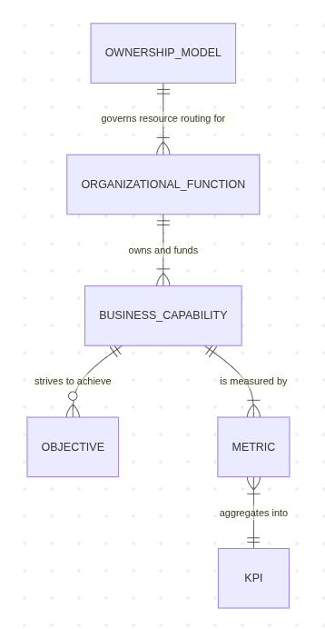

## Governance and Compliance Diagram
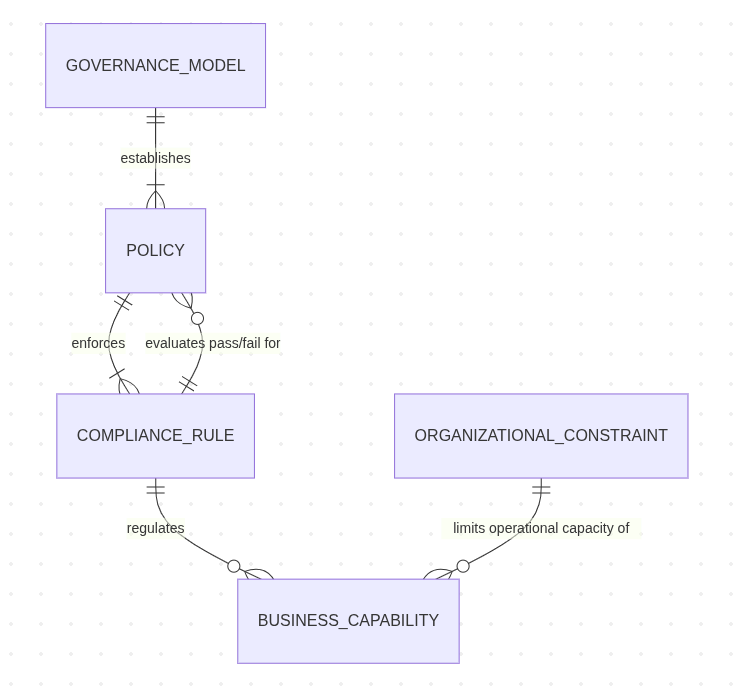

---
