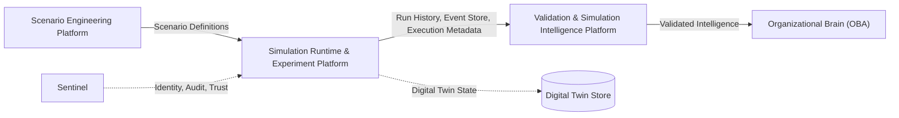
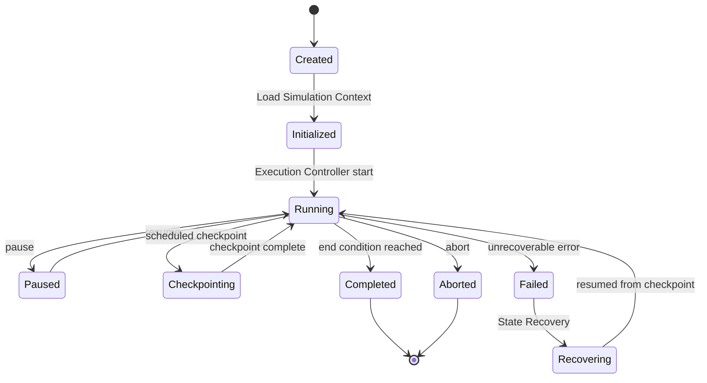
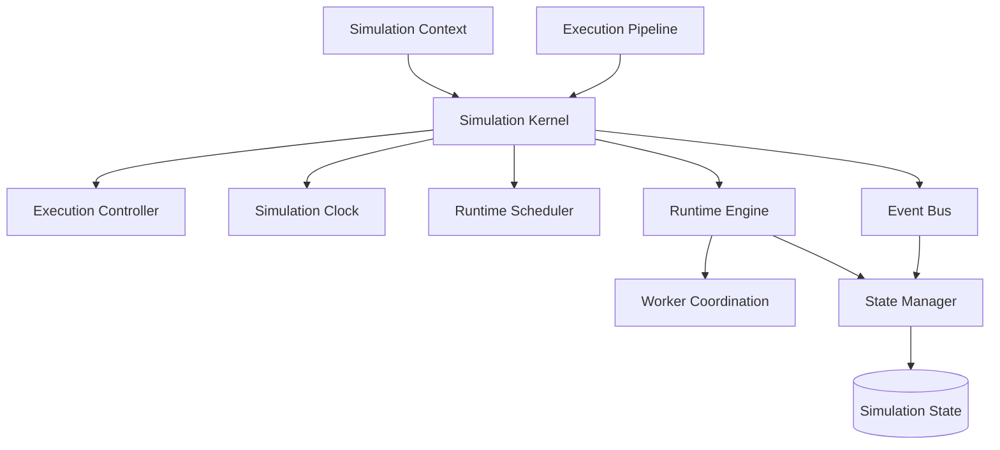
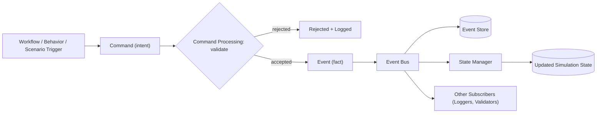
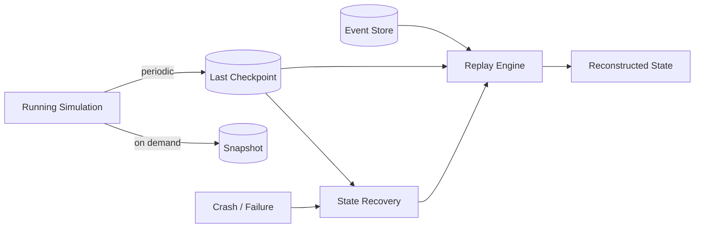
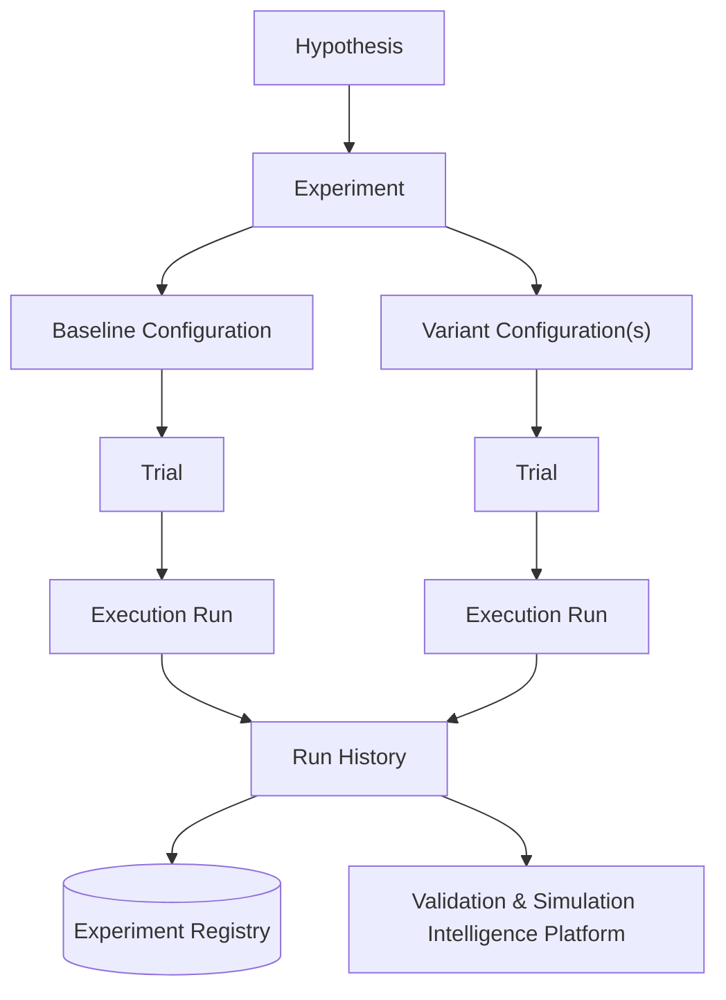

# Simulation Runtime & Experiment Platform Specification
*Arcturus v1.0 — Horquva Synthetic Enterprise Platform*

**Platform:** Simulation Runtime & Experiment Platform
**Platform Owner:** Muhammad Maaz Khan
**Sprint:** Week 2 — Engineering Foundation
**Status:** Draft — pending Team Lead & constitutional compliance review
**Classification:** Horquva Confidential & Proprietary
**Upstream dependency:** Scenario Engineering Platform
**Downstream consumer:** Validation & Simulation Intelligence Platform

---

## Table of Contents

1. Purpose & Scope
2. Platform Context
3. Simulation Runtime Architecture (Day 1)
4. Event Processing & Runtime State Management (Day 2)
5. Experiment Framework & Scientific Execution (Day 3)
6. Architecture Review & Handover (Day 4)
7. Glossary
8. Week 2 Deliverables Traceability

---

## 1. Purpose & Scope

The Simulation Runtime & Experiment Platform is the operational core of Arcturus. It is responsible for executing every synthetic enterprise simulation: coordinating simulation time, processing events, managing organizational state, and running scientific experiments in a controlled, repeatable, measurable way.

Where the **Scenario Engineering Platform** defines *what should happen* in an experiment, this platform defines and governs *how it actually runs* — deterministically, reproducibly, and under scientific rigor.

**In scope for Week 2:**
- Constitutional (conceptual) architecture of the simulation runtime
- Event processing and runtime state management model
- Experiment lifecycle and scientific execution framework
- Cross-platform dependency mapping and handover readiness

**Out of scope for Week 2** (per the Sprint Objective — no production-grade engine expected):
- Concrete implementation, code, or infrastructure
- Programming language, database, or messaging technology selection
- Distributed systems implementation detail (only the coordination *contract* is defined)

This specification is technology-agnostic by design, per the Architecture Compliance principle: it defines responsibilities and contracts, not implementations.

## 2. Platform Context

The Simulation Runtime & Experiment Platform sits between the platform that defines scenarios and the platform that scientifically evaluates results:

- **Scenario Engineering Platform (upstream):** supplies the scenario definitions this platform binds to a Simulation Context and executes.
- **Validation & Simulation Intelligence Platform (downstream):** consumes Run History, the Event Store, and Execution Metadata produced by this platform to scientifically evaluate outcomes.
- **Sentinel:** provides identity, security, governance, audit, and trust guarantees that this platform's Execution Logs and Experiment Registry rely on.
- **Digital Twins:** every simulated entity's evolving state, per the constitutional principle "Digital Twins Represent Reality," is written and read through this platform's State Manager.

## 3. Simulation Runtime Architecture (Day 1)

Every organizational simulation depends on a stable, deterministic execution environment. This section defines the runtime components, their responsibilities, and the lifecycle every simulation instance follows from creation to completion.

### 3.1 Runtime Components

| Component | Responsibility |
|---|---|
| **Simulation Kernel** | The single authoritative orchestrator for one simulation instance. Owns the master execution loop and coordinates the Clock, Scheduler, Event Bus, and State Manager. |
| **Runtime Engine** | The execution layer beneath the Kernel. Translates scheduled events and workflow steps into concrete state transitions. Hosts Worker Coordination. |
| **Simulation Context** | The bounded "world" of a single run: configuration, seed, participating entities (organization, employees, workflows), scenario bindings, and resource limits. |
| **Execution Controller** | Exposes lifecycle operations (start, pause, resume, stop, abort) and enforces valid transitions between them. |
| **Simulation State** | The canonical, versioned representation of the organization at simulated time *T*, including all entity states and pending work. |
| **Simulation Clock** | Governs simulated time independently of wall-clock time. Supports multiple modes: real-time, accelerated, and stepped/discrete-event. |
| **Runtime Scheduler** | Maintains the event calendar and dispatches work according to the Clock, in deterministic order. |
| **Worker Coordination** | The coordination contract for executing independent sub-simulations or entities in parallel — a contract, not an implementation. |
| **State Manager** | Mediates every read and write to Simulation State, enforcing consistency, versioning, and access control. |
| **Execution Pipeline** | The ordered stages every run passes through: Initialize → Load Context → Bind Scenario → Run Loop → Checkpoint → Finalize → Archive. |

### 3.2 Runtime Lifecycle

Every simulation instance moves through a constitutional lifecycle enforced by the Execution Controller:

**Determinism requirement:** given an identical Simulation Context (including seed), the Kernel must produce an identical sequence of state transitions on every run. This is the foundation of reproducibility for Section 5.

### 3.3 Conceptual Architecture

The Kernel is the only component permitted to mutate the Execution Controller's lifecycle state. All other components communicate through the Event Bus or the State Manager — never by mutating Simulation State directly. This isolation is what keeps replay (Section 4) deterministic.

## 4. Event Processing & Runtime State Management (Day 2)

Organizations evolve through continuous events, not isolated operations. This section defines how the runtime processes those events and how simulation state is captured, replayed, and recovered — the mechanisms that make every simulation auditable and reproducible.

### 4.1 Event Processing Components

| Component | Responsibility |
|---|---|
| **Event Bus** | Publish/subscribe backbone decoupling event producers (workflow engine, behavior models, scenario triggers) from consumers (State Manager, loggers, validators). |
| **Event Queue** | Ordered buffer of pending events awaiting dispatch, ordered by simulation time, then priority. |
| **Event Store** | Append-only, immutable log of every event that occurred during a run. The source of truth for replay and audit. |
| **Command Processing** | Validates external intents ("commands") before they are allowed to become immutable "events." Commands may be rejected; events may not. |
| **State Transitions** | Deterministic, pure functions of (prior state, event) → new state. No transition may depend on wall-clock time or external I/O. |
| **Event Ordering** | Deterministic ordering: simulation time first, then a documented causal tie-breaker, guaranteeing identical replays for identical inputs. |

### 4.2 Runtime State Management Components

| Component | Responsibility |
|---|---|
| **Checkpoints** | Periodic, durable captures of the full Simulation State and Clock position, enabling resumption without a full replay. |
| **Snapshots** | Lightweight, often partial, state captures (e.g. a single entity) for inspection or debugging without pausing the run. |
| **Rollback** | Controlled reversion to a prior checkpoint, used for what-if branching, error recovery, or re-running a Trial. |
| **Replay Engine** | Deterministically reconstructs state by re-applying the Event Store from a checkpoint (or genesis). The backbone of reproducibility. |
| **State Recovery** | Crash/failure recovery: resume from the last valid checkpoint and replay subsequent events. |
| **Execution Logs** | Human- and AI-readable observability record of runtime activity. Distinct from the Event Store: logs are for observability, the Event Store is for reproducibility. |

### 4.3 Event Flow

### 4.4 Checkpoint & Replay Flow

## 5. Experiment Framework & Scientific Execution (Day 3)

Simulation alone is not evidence. This section defines how individual runs are organized into formal, repeatable scientific experiments that produce evidence the Validation & Simulation Intelligence Platform can evaluate.

### 5.1 Core Concepts

| Concept | Definition |
|---|---|
| **Hypothesis** | A falsifiable statement about expected organizational behavior or outcome under specified conditions — the "why" behind an experiment. |
| **Experiment** | A structured investigation designed to test one Hypothesis. Groups one or more Trials around a Baseline and its Variants. |
| **Trial** | A single controlled execution attempt: one Configuration, one seed, one outcome. |
| **Configuration** | The full parameter set defining a Trial — Simulation Context, scenario bindings, entity population, duration, clock mode. |
| **Baseline** | The reference Configuration representing the current/control state, against which Variants are measured. |
| **Variant** | An alternative Configuration representing the hypothesis-driven change under test. |
| **Execution Run** | The concrete, tracked instance of executing a Trial — maps 1:1 to one Runtime lifecycle instance (Section 3.2). |
| **Experiment Registry** | The authoritative, versioned catalog of every Hypothesis, Experiment, Trial, Configuration, Baseline, and Variant ever defined. |
| **Run History** | The chronological, immutable record of every Execution Run and its outcome, linked to the Registry. |
| **Reproducibility Rules** | The constitutional determinism contract: identical Configuration + seed must always yield an identical result. Documents any permitted, explicitly declared sources of variation. |
| **Seed Management** | How random seeds are generated, recorded, and propagated to every stochastic subsystem (behavior models, event jitter, sampling). |
| **Execution Metadata** | The structured record attached to every run: trigger, spec versions, simulated start/end time, wall-clock duration, checkpoint and Event Store references, outcome status. |

### 5.2 Experiment Lifecycle

Every Execution Run is executed by the Runtime described in Section 3, produces an Event Store and checkpoints as described in Section 4, and is recorded to Run History with full Execution Metadata before being handed to the Validation & Simulation Intelligence Platform for scientific evaluation.

## 6. Architecture Review & Handover (Day 4)

This section closes Week 2 with a self-review against the constitutional criteria and a clear handover contract to the platforms that depend on this one.

### 6.1 Review Checklist

| Criterion | Status | Reference |
|---|---|---|
| Runtime architecture completeness | Draft complete | §3 |
| Event processing consistency | Draft complete | §4 |
| Scheduling framework | Draft complete | §3.1, §3.3 |
| State management | Draft complete | §4.2 |
| Experiment lifecycle | Draft complete | §5.2 |
| Reproducibility principles | Draft complete | §5.1 |
| Documentation quality | Pending Team Lead review | — |
| Cross-platform compatibility | Pending Scenario & Validation platform sign-off | §6.2 |
| Architectural compliance | Pending Team Lead constitutional review | — |

### 6.2 Cross-Platform Dependencies

- **Scenario Engineering Platform (upstream):** must confirm scenario definitions can bind cleanly to a Simulation Context (§3.1) without platform-specific assumptions.
- **Validation & Simulation Intelligence Platform (downstream):** consumes Run History, the Event Store, and Execution Metadata (§4, §5) — this handover contract is the primary Week 2 output for this platform.
- **Sentinel:** Execution Logs and the Experiment Registry are expected to be auditable and traceable per Sentinel's identity/governance requirements.

### 6.3 Handover Notes

This specification is ready to hand to the Validation & Simulation Intelligence Platform Owner for review of the Run History / Event Store / Execution Metadata contract. Open items for Week 3:

- Confirm the exact schema of Execution Metadata with the Validation platform.
- Confirm the Worker Coordination contract with the Team Lead before any distributed-execution assumptions are made.
- Validate this specification against the full frozen Arcturus v1.0 Constitutional Platform Architecture (not fully reproduced in this excerpt) before merge.

### 6.4 Constitutional Principle Alignment

| Principle | How this platform applies it |
|---|---|
| Science Before Assumption | Reproducibility Rules (§5.1) make every result falsifiable and reproducible, not assumed. |
| Platforms Before Features | The Runtime (§3) is built as a reusable execution engine, not scenario-specific code. |
| Digital Twins Represent Reality | The State Manager (§3.1) reads/writes through to the shared Digital Twin Store (§2). |
| Validation Before Intelligence | Every run hands Run History and the Event Store (§5.2) to the Validation Platform before any result reaches the Organizational Brain. |
| Governance Enables Scientific Trust | The Experiment Registry and Execution Metadata (§5.1) make every run versioned, auditable, and traceable. |

## 7. Glossary

- **Baseline** — reference Configuration for comparison.
- **Checkpoint** — durable full-state capture for resumption.
- **Command** — a validated intent that may become an Event.
- **Configuration** — full parameter set for a Trial.
- **Event** — an immutable fact recorded to the Event Store.
- **Event Bus** — pub/sub backbone for runtime events.
- **Event Store** — append-only log of all events in a run.
- **Execution Controller** — lifecycle state machine for a run.
- **Execution Metadata** — structured record describing a run.
- **Execution Pipeline** — the Init→Archive stage sequence.
- **Execution Run** — a tracked instance of executing a Trial.
- **Experiment** — structured test of one Hypothesis.
- **Experiment Registry** — versioned catalog of all experiment artifacts.
- **Hypothesis** — a falsifiable statement under test.
- **Replay Engine** — deterministic state reconstruction from the Event Store.
- **Rollback** — controlled reversion to a prior checkpoint.
- **Run History** — immutable record of all Execution Runs.
- **Seed Management** — generation/propagation of deterministic randomness.
- **Simulation Clock** — governs simulated time.
- **Simulation Context** — the bounded world of one run.
- **Simulation Kernel** — the run's central orchestrator.
- **Simulation State** — canonical state of the organization at time T.
- **Snapshot** — lightweight, partial state capture.
- **State Manager** — mediates all reads/writes to Simulation State.
- **State Recovery** — crash recovery via checkpoint + replay.
- **Trial** — one controlled execution attempt.
- **Variant** — a hypothesis-driven alternative Configuration.
- **Worker Coordination** — contract for parallel/distributed execution.

## 8. Week 2 Deliverables Traceability

| Deliverable | Section |
|---|---|
| Constitutional Simulation Runtime Architecture | §3 |
| Simulation Kernel architecture | §3.1, §3.3 |
| Runtime execution lifecycle | §3.2 |
| Event Processing Architecture | §4.1, §4.3 |
| Event Bus and Event Store concepts | §4.1 |
| Simulation Clock and Scheduling Framework | §3.1 |
| Runtime State Management model | §4.2 |
| Checkpoint, Snapshot, Replay, Rollback models | §4.2, §4.4 |
| Scientific Experiment Framework | §5 |
| Hypothesis, Trial, Baseline, Variant, Run lifecycle | §5.1, §5.2 |
| Experiment Registry specification | §5.1 |
| Reproducibility and Seed Management principles | §5.1 |
| Runtime execution metadata specification | §5.1 |
| Cross-platform runtime review | §6.2 |
| Handover to Validation & Simulation Intelligence Platform | §6.3 |

---

*This is a Week 2 constitutional architecture draft. Per the Arcturus AI Engineering Policy, it is intended as an accelerant for your own engineering judgment — review, adjust, and validate it against the full frozen constitutional architecture before requesting Team Lead approval.*
