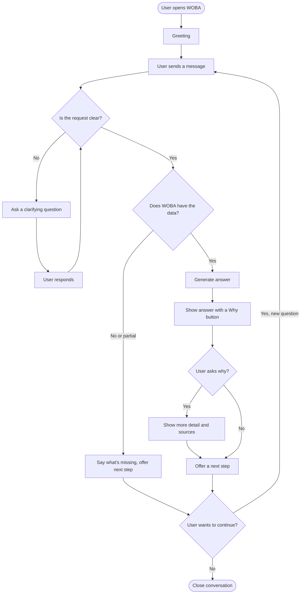
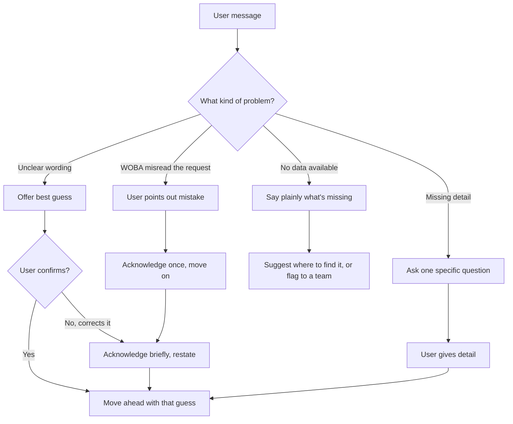
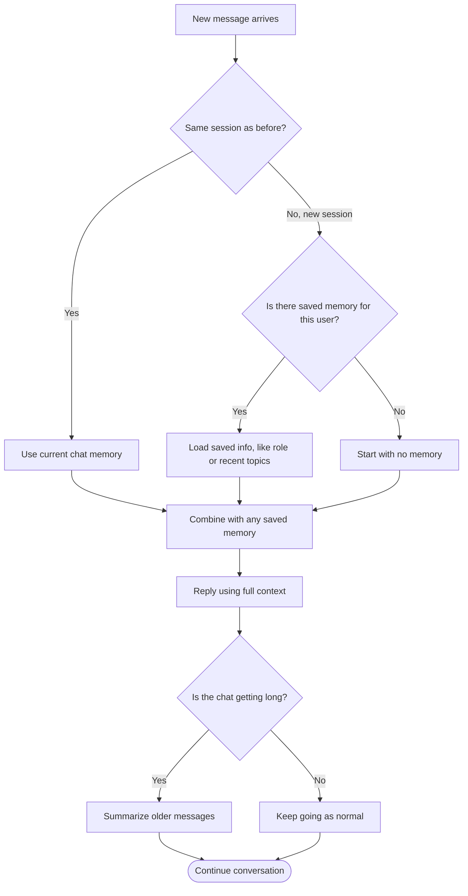

 Day 3 — Conversation Flow Diagrams

**Ahmad Ali Sultan** · AI Experience Engineering, Castor

**Week 2, Day 3**

---

## What today was about

Day 2 gave us the messages WOBA can say.

Today's job was connecting those messages into full paths.

This means showing the whole journey: from the moment a user opens WOBA, to the moment their task is done.

It also means showing what happens when something goes wrong along the way, like unclear input, or WOBA not knowing the answer.

**Key idea from Day 1 research:** most problems happen in the *middle* of a conversation, not at the start. So each diagram below shows real branches, not just one straight line.

---

##  1. The main journey

This is the normal path: understand the question, ask for clarification if needed, give an answer, suggest a next step, then close or continue.

---

##  2. What happens when something goes wrong

This part matters most, since it is the part most tools forget to design. There are four common problems, and each one has its own fix.

**Simple rule I followed:** never quietly guess. Every "problem" path ends in either a confirmed correction, or an honest "I don't have this."

---

##  3. Memory across a conversation

This maps back to the "silent forgetting" problem from Day 1. It shows exactly what gets remembered, and for how long.

---

##  Open questions after today

| Question | Who Needs to Answer It |
|---|---|
| What counts as "one session"? For example, closed tab, or 30 minutes idle? | Backend / Platform team |
| How much detail should the "Why this?" button show? | Gulshan and me |
| Does topic-switching need special logic, or does the AI handle it on its own? | Engineering team |

---

