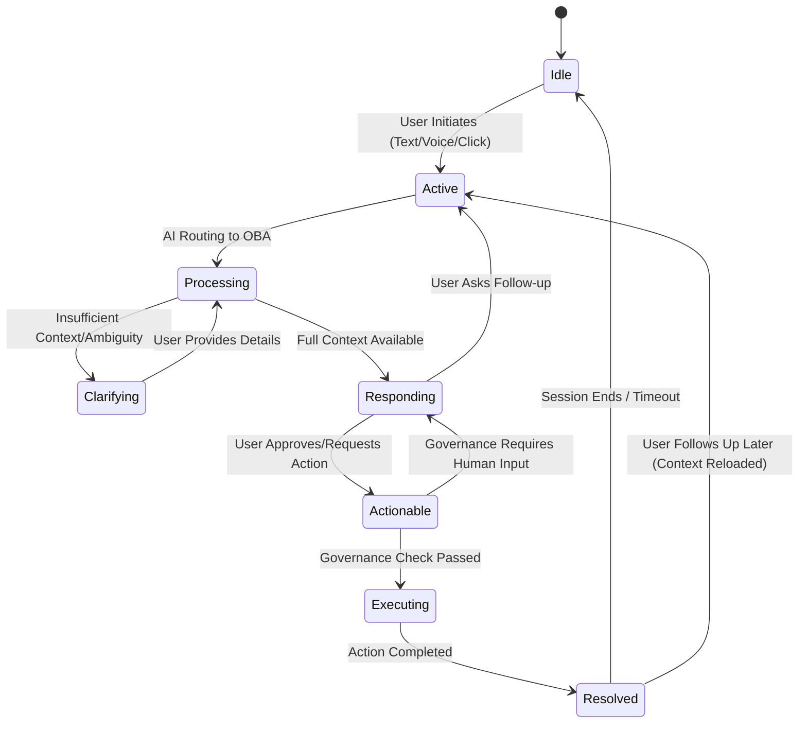

# CASTOR v1.0 – AI Experience Platform
## Day 2: Conversation & Context Design

**Owner:** Gulshan Kumar, AI Experience Engineer
**Status:** Architecture – Draft for Review

---

## 1. Objective

Define the conversational logic and context management approach that lets the Organizational Brain Agent (OBA) hold coherent, personalized, multi-turn dialogues across Horquva's products.

---

## 2. Conversation State Machine

Every conversation moves through a defined set of states so behavior stays predictable and the user retains control.

| State | Description | User Perception |
|---|---|---|
| Idle | Awaiting user input | Empty state with suggested prompts |
| Active | Query submitted, context loading | "Thinking..." indicator, cancel option |
| Processing | AI querying OBA agents (Ops, Sales, Analytics) | Status line, e.g. "Checking operations..." |
| Clarifying | AI needs 1–2 details to narrow results | Single direct question with suggested answers |
| Responding | Synthesized answer presented | Summary + data + actions |
| Actionable | AI proposes a task (draft, schedule, automate) | Approve / Edit / Reject buttons |
| Executing | Orchestration Engine performs the action | Progress bar or confirmation banner |
| Resolved | Task complete or query answered | Resolved marker, option to pin |

---

## 3. Three-Tier Context Management

| Tier | Scope | Persistence | Stores |
|---|---|---|---|
| Session Context | Current conversation | Expires after 30 min inactivity | Current topic, recent questions, temporary preferences |
| User Context | Individual user, across sessions | Persistent | Role, frequent queries, saved KPIs and filters |
| Organizational Context | Global | Persistent, updated live | Company goals, announcements, active incidents, current revenue/MRR |

**Context loading sequence on session start:**
1. Identity check (Sentinel) — verify role and permissions.
2. Load user context — recent history, saved preferences.
3. Load organizational context — active alerts, pinned global items.
4. Merge into system prompt: *"You are speaking to [Role]. They last asked about [Topic]. The company currently has [Alert]."*

---

## 4. AI Response Structure

Every response follows a fixed five-part structure. Content within each block is flexible; the blocks themselves are not optional.

1. **Header** – acknowledges the intent ("You asked about the current ticket backlog.")
2. **Executive Summary** – the bottom line in one or two lines.
3. **Detailed Breakdown** – supporting data, with source and timestamp.
4. **Contextual Insight** – the "why" behind the numbers, with links to detail views.
5. **Actionable Suggestions** – next-step buttons (draft, assign, schedule).

---

## 5. Multi-Turn & Follow-Up Handling

**Follow-up detection:** the AI checks the new query against the last three messages. A query missing a subject inherits the subject from the prior turn.

Example:
- Turn 1 — "What were sales numbers in Q2?" → "Sales were $2.1M."
- Turn 2 — "And Q1?" → inherits "sales numbers" → "Q1 was $1.8M."
- Turn 3 — "Why the drop?" → inherits "the drop" (Q1 vs Q2) → "Drop due to loss of client X in March."

**Pivot logic:** an explicit subject change ("Never mind that, check tickets.") discards the active thread and starts a new one, but the prior thread stays in memory for manual recall ("Go back to sales").

---

## 6. Suggested Prompts by State

| State | Suggested Prompts |
|---|---|
| Idle | "What are my top priorities today?" / "Summarize overnight activity." |
| Data presented | "Show me the raw data." / "What are the risks?" / "Compare to last week." |
| Actionable | "Draft the email." / "Schedule a review." / "Automate this." |
| Clarifying | 2–3 possible interpretations as a short list |

---

## 7. Note for Executive Workspace Integration

The response structures above need to fit into the Executive Copilot sidebar layout being built by Taha's team. This is not a standalone chat UI — it's the intelligence layer that plugs into the existing dashboard, so the header/summary/data/insight/action blocks should map directly to sidebar components rather than a chat thread.
