# Horquva Design System Platform

Visual reference for the Design Foundation (Day 1) and Component Library (Day 3) deliverables. Images are exported from the Figma source file.

---

## Design Foundation

### Color Scheme
Primary (indigo), neutral (graphite), and semantic (success/warning/error) color ramps.

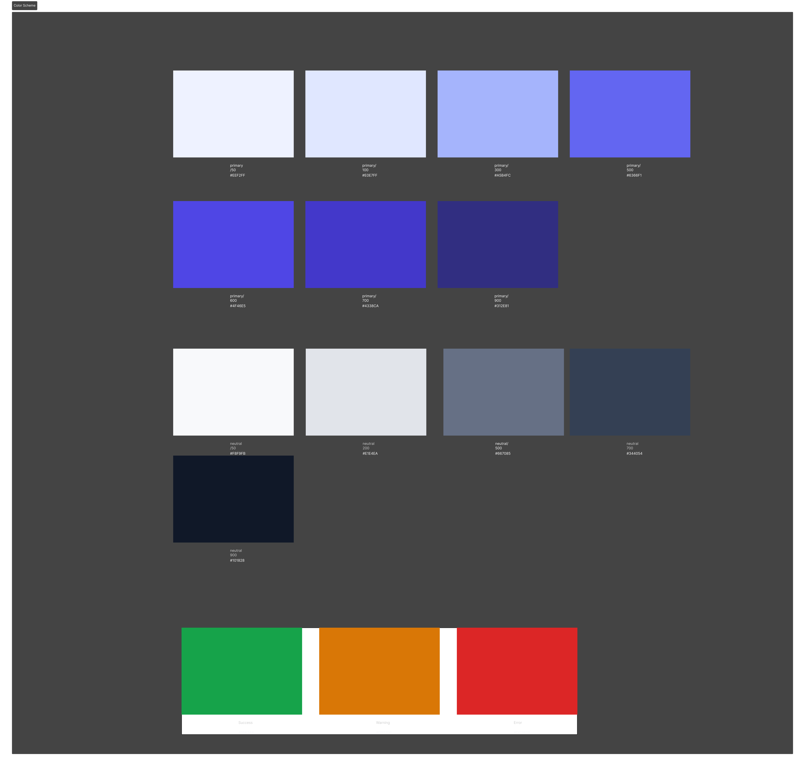

### Typography
Type scale from H1 through Caption, built on Inter.

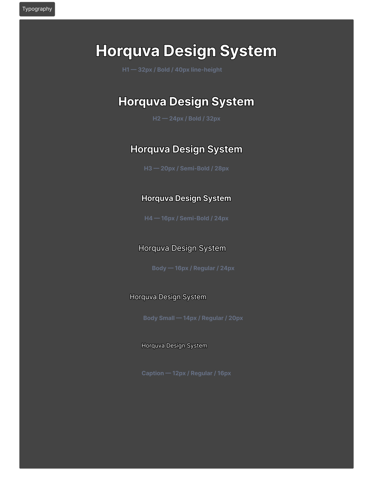

### Spacing
8px-based spacing scale, `spacing/xs` (4px) through `spacing/4xl` (96px).

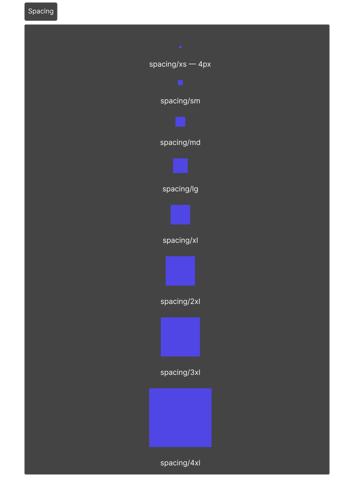

### Grid
Responsive column grids for Desktop (12 col), Tablet (8 col), and Mobile (4 col).

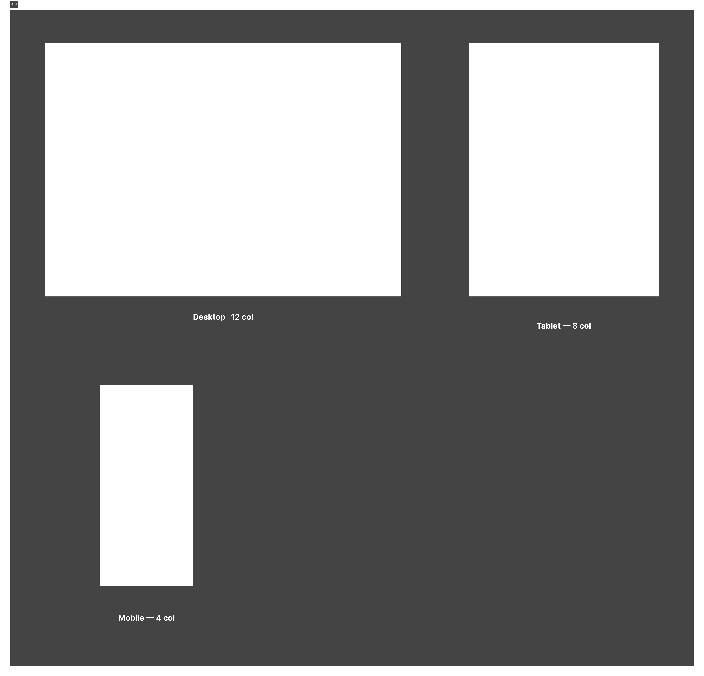

### Elevation
Four shadow levels: card, dropdown, modal, popover.

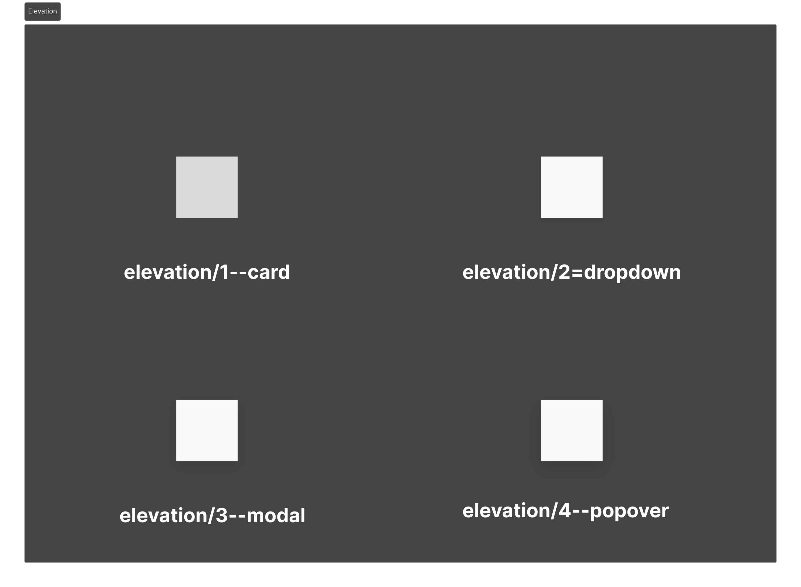

### Border Radius
Radius scale from sharp corners to full pill shapes.

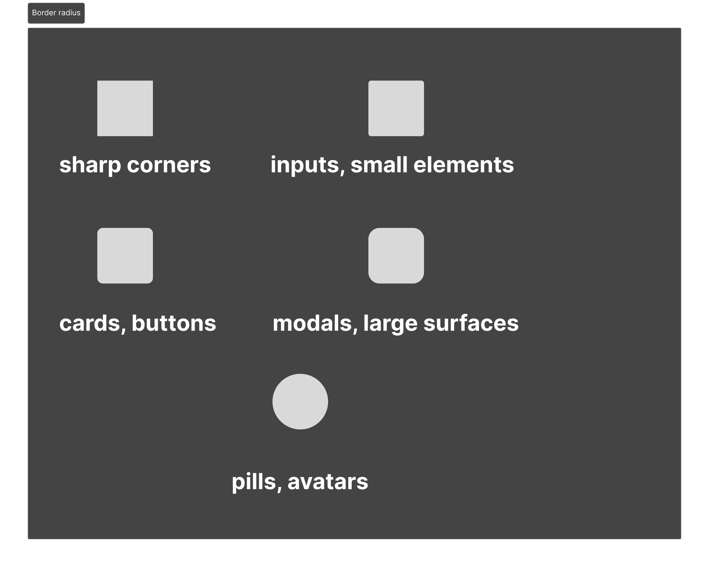

### Iconography
Lucide icon set — 24px, 2px stroke, outline only.

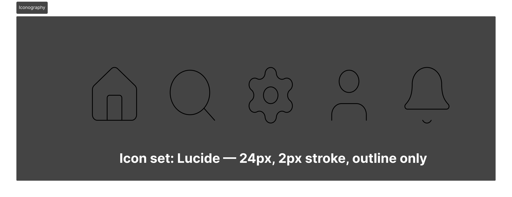

---

## Component Library

### Button
Primary, Secondary, Hover, and Disabled states.

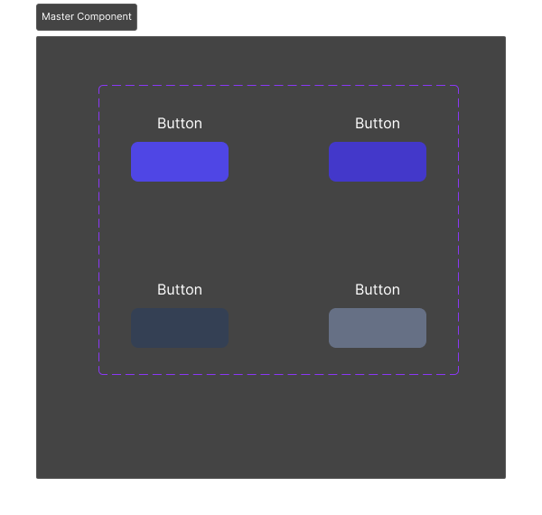

### Input Field
Default, Focus, Error, and Disabled states.

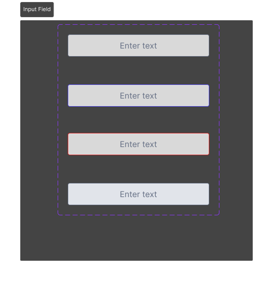

### Card
Default card container with placeholder content.

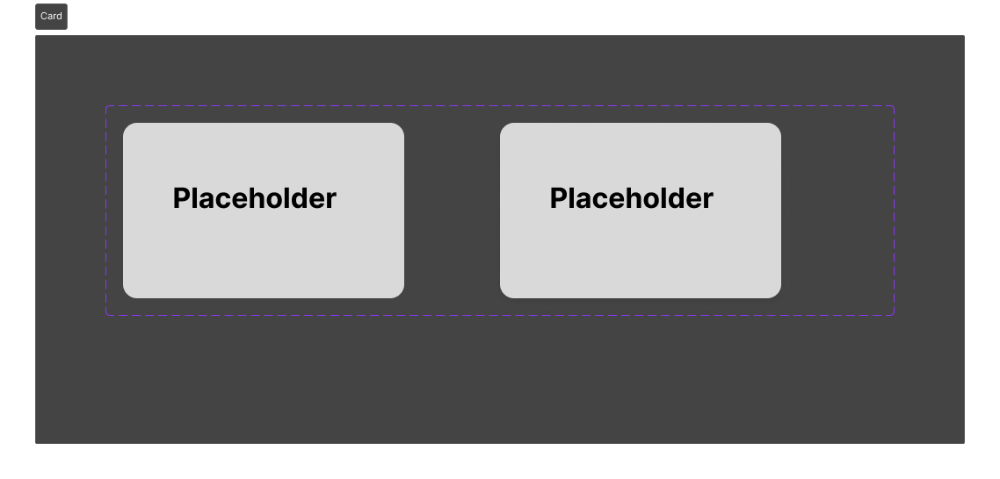

### Badges
Info, Success, Error, and Warning variants.

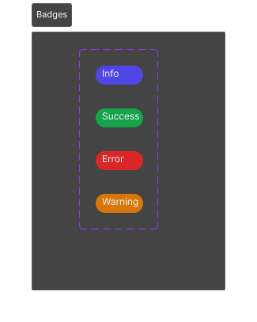

### Chip
Default and Selected states with removable icon.

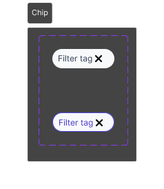

### Avatar
Small, Medium, and Large sizes.

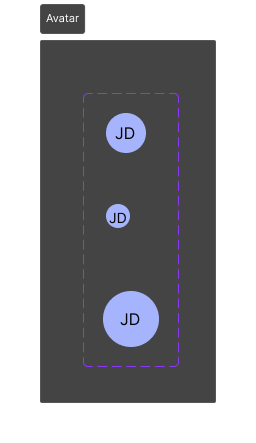

### Dialog
Modal composition with header, body text, and footer actions (Cancel / Delete).

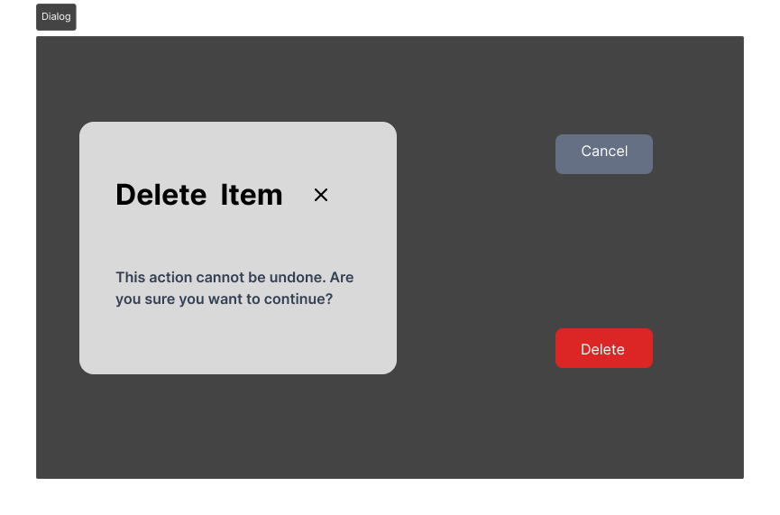

### Navigation
Top navigation bar with logo, links, and user avatar.

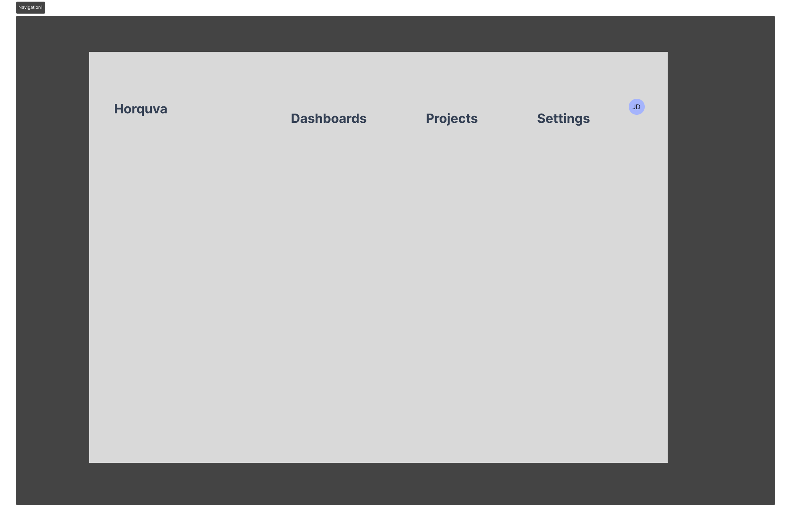

### Table
Header row and data rows.

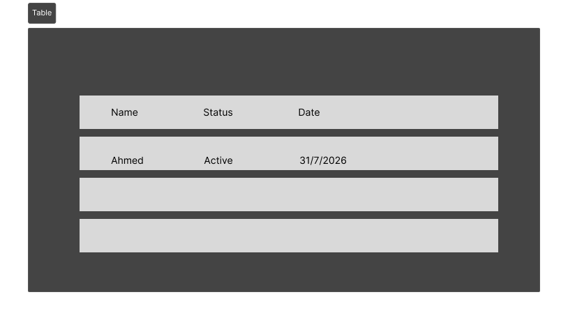

### Progress Indicator
Linear progress bar across multiple fill states.

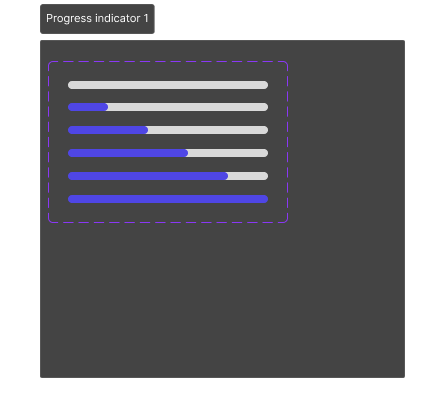

### Loading Components
Loading spinner indicator.

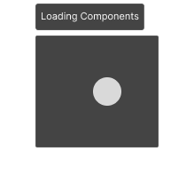

### Empty State
Icon, heading, description, and action button for zero-result states.

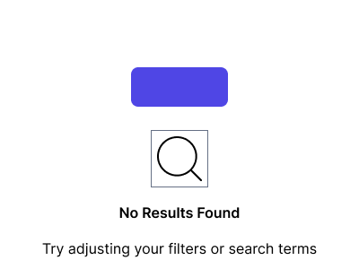

---

*Horquva Design System Platform — Figma export reference*
