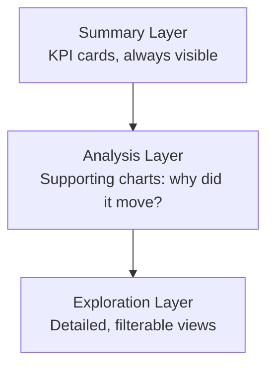
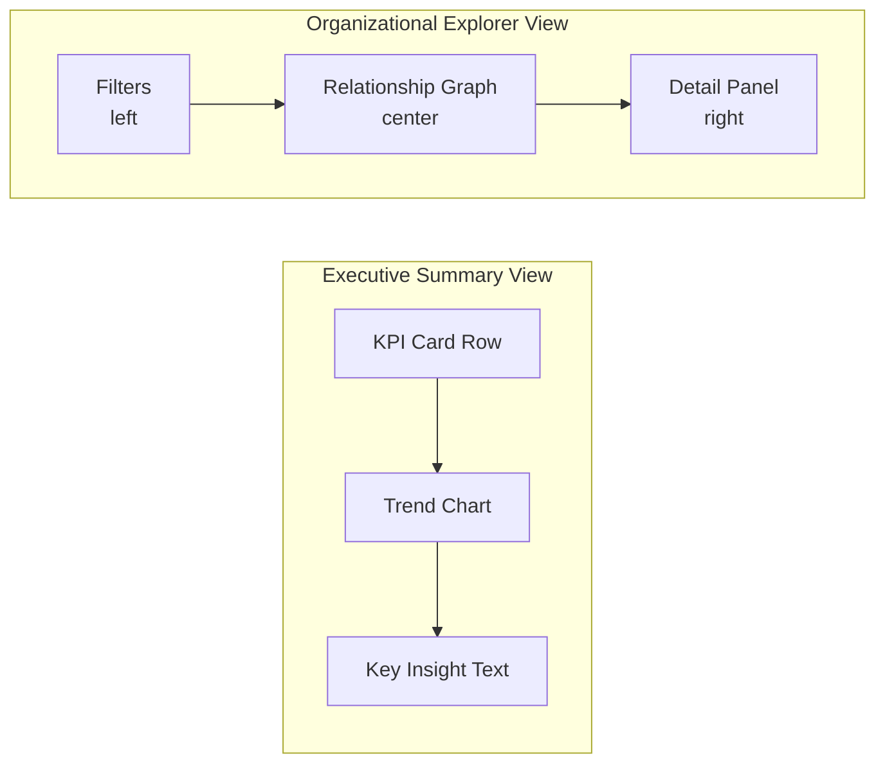

# Day 1 — Visualization Foundation

**Platform:** Visualization
**Owner:** Hazam Mehmood
**Branch:** platform/visualization
**Version:** 1.0
**Status:** Complete

---

## Overview

Day 1 establishes the constitutional foundation of the Visualization Platform: the core principles, chart taxonomy, dashboard strategy, executive KPI framework, and information hierarchy that every future dashboard, report, and analytical interface will inherit.

---

## Visualization Principles

1. **Clarity before decoration.** Every chart or graphic exists to answer a specific question. If a visualization doesn't help someone decide or understand something faster, it doesn't belong on the screen.
2. **Consistency across the platform.** The same data type is always visualized the same way, whether it appears in a dashboard, a report, or a conversational AI response.
3. **Progressive disclosure.** Show the summary first. Users drill into detail only when they ask for it, instead of being shown every metric at once.
4. **Executive-first design.** Visualizations should be scannable in seconds by a senior leader with no technical background in the underlying data.

---

## Chart Taxonomy

| Data type | Recommended visualization | Use case |
|---|---|---|
| Trends over time | Line chart, area chart | Productivity trends, revenue history |
| Comparisons | Bar chart, grouped bar chart | Team performance, department comparisons |
| Composition | Stacked bar, donut chart | Budget allocation, workforce breakdown |
| Relationships/networks | Node-link graph | Organizational relationships, knowledge graphs |
| Distributions | Histogram, box plot | Workload distribution, risk scoring |
| Single KPI | KPI card with trend indicator | Executive summary tiles |
| Hierarchies | Tree diagram, org chart | Reporting structures, decision paths |

---

## Dashboard Strategy

Dashboards are organized in three layers:

- **Summary layer:** Top-level KPI cards, always visible, no scrolling required.
- **Analysis layer:** Supporting charts that explain *why* a KPI moved.
- **Exploration layer:** Detailed, filterable views for users who want to dig further.

---

## Executive KPI Framework

Every KPI shown to an executive includes four elements: the current value, the trend direction, a plain-language explanation of what changed, and a suggested next action where relevant. A number alone is not sufficient — OBA should always explain *why* it moved.

---

## Information Hierarchy

Visual weight is assigned by decision impact, not by how much data is available. The most decision-critical insight is always the largest and highest-positioned element on the screen.

---

## Initial Wireframes (Conceptual)

- **Executive summary view:** KPI card row → trend chart → key insight text.
- **Organizational explorer view:** relationship graph (center) → filters (left) → detail panel (right).
- **Report view:** narrative summary → supporting chart → data table.

---

## Day 1 Outcome

A documented visualization architecture establishing the constitutional principles for presenting organizational intelligence, ready to support Day 2's organizational intelligence visualization work.
