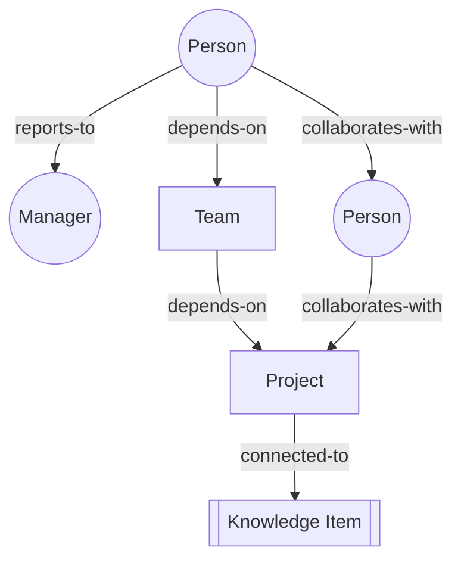
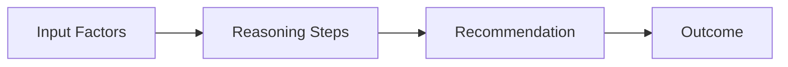

# Day 2 — Organizational Intelligence Visualization

**Platform:** Visualization
**Owner:** Hazam Mehmood
**Branch:** platform/visualization
**Version:** 1.0
**Status:** Complete

---

## Overview

Day 2 defines how the Organizational Brain's knowledge, memory, reasoning, and relationships are represented visually — concepts that traditional dashboards cannot adequately express on their own.

---

## Organizational Graph Concepts

Organizations are modeled as a network of people, teams, projects, and knowledge, connected by relationships (reports-to, collaborates-with, depends-on). A node-link graph is the base visual pattern, with node size reflecting relevance and edge thickness reflecting relationship strength.

*Node size = relevance, edge thickness = relationship strength.*

---

## Knowledge Relationship Diagrams

Represent how a decision, document, or policy connects to related knowledge. Users start from one item and expand outward to see what's connected, rather than searching through a flat list.

---

## Memory Timeline Concepts

The Organizational Brain retains history, so it needs a timeline view: a horizontal axis of events (decisions, changes, incidents) that can be filtered by team, project, or time range, letting a user see how the organization arrived at its current state.

---

## Organizational Hierarchy Visualization

Standard collapsible tree view for reporting lines, with the ability to overlay metrics (headcount, performance, workload) directly on the hierarchy rather than requiring a separate report.

---

## Decision Flow Concepts

Visualize a decision as a path: input factors → reasoning steps → recommendation → outcome. This makes OBA's reasoning auditable instead of a black box.

---

## Interaction Principles

Users can click any node in a graph or timeline to open a detail panel, without losing their place in the overall view (no full-page navigation away from the graph).

---

## Day 2 Outcome

A constitutional visualization framework for representing the Organizational Brain's knowledge and relationships, ready to feed into Day 3's executive analytics framework.
