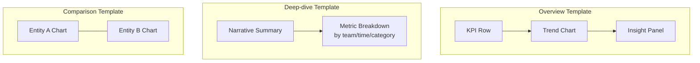

# Day 3 — Executive Analytics Framework

**Platform:** Visualization
**Owner:** Hazam Mehmood
**Branch:** platform/visualization
**Version:** 1.0
**Status:** Complete

---

## Overview

Day 3 establishes the reusable analytics framework executives will rely on: dashboard templates, KPI card design, chart selection rules, insight panels, filtering, and data storytelling guidelines.

---

## Executive Dashboard Templates

- **Overview template:** KPI row + one trend chart + one insight panel.
- **Deep-dive template:** single metric, broken down by team/time/category, with a narrative summary at the top.
- **Comparison template:** two or more entities (teams, periods) shown side by side using matched chart types.

---

## KPI Card Concept

Each card shows: label, current value, trend arrow with percentage change, and a one-line plain-language explanation. Color indicates direction (positive/negative/neutral), never severity alone, to stay accessible for color-blind users.

---

## Chart Selection Guidelines

Choose the simplest chart type that answers the question. Default to bar or line charts; use network graphs only for genuinely relational data, and avoid 3D or decorative chart styles that don't add clarity.

---

## Executive Insight Panels

A short block of generated text next to every chart that states, in plain language, what the chart shows and why it matters. This is what separates a dashboard from a report.

---

## Filtering Concepts

Filters are global where possible (time range, team, initiative) so a user sets context once and every chart on the screen updates together, instead of filtering each chart individually.

---

## Data Storytelling Guidelines

Every dashboard should read top to bottom like a short story: headline insight first, supporting evidence second, recommended action last.

---

## Day 3 Outcome

A reusable executive analytics framework capable of supporting future organizational intelligence experiences across WOBA, ready for Day 4 review and readiness reporting.
