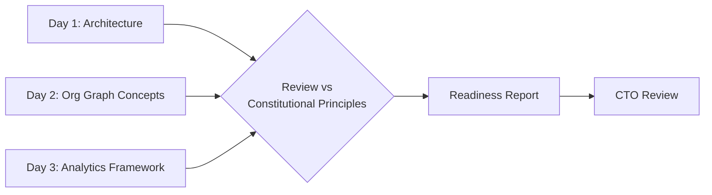

# Day 4 — Visualization Review & Readiness Report

**Platform:** Visualization
**Owner:** Hazam Mehmood
**Branch:** platform/visualization
**Version:** 1.0
**Status:** Ready for CTO review

---

## Overview

Day 4 validates all Week 2 visualization work against Horquva's constitutional architecture before implementation begins, and closes the sprint with a formal readiness report.

---

## Review Summary

| Review item | Result |
|---|---|
| Visualization architecture vs. Horquva's constitutional design principles | Consistent |
| Dashboard concepts vs. chart taxonomy | No conflicting patterns found |
| Organizational graph & knowledge relationship concepts vs. OBA data model | Aligned |
| Documentation completeness across Days 1–3 | Complete |

---

## Visualization Readiness Report

**Platform:** Visualization
**Week:** 2
**Status:** Ready for CTO review

### Summary

The Visualization Platform's constitutional foundation is established. Core principles, chart taxonomy, dashboard strategy, and executive KPI standards are documented. Concepts for representing organizational graphs, knowledge relationships, and memory timelines are defined at the architecture level. An executive analytics framework, including dashboard templates, KPI card design, and data storytelling guidelines, is complete.

### Outstanding Items for Future Sprints

- Detailed visual design (color, typography) should be finalized in coordination with the Design System platform.
- Interactive prototypes are not yet built, as Week 2 scope was architecture and concepts rather than implementation.

### Recommendation

Approve the visualization architecture as the standard for all future dashboard and reporting work across WOBA, and proceed to prototyping in the next sprint.

---

## Day 4 Outcome

The Visualization Platform is fully architected, documented, and prepared to transform Organizational Brain intelligence into intuitive executive experiences.
